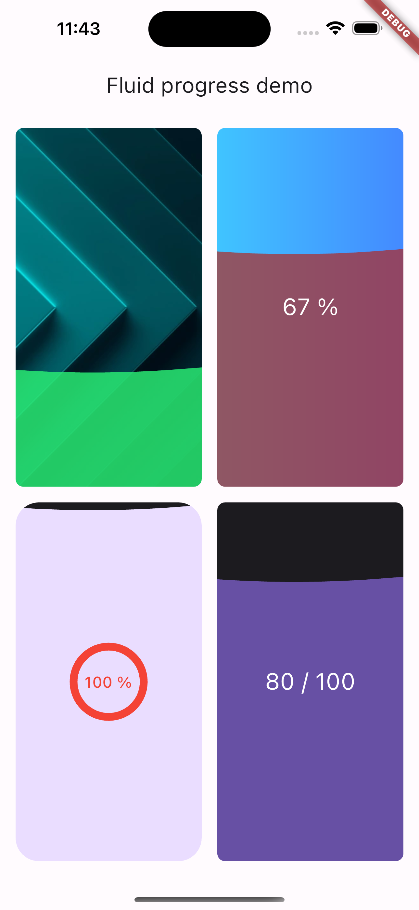

# Fluid Progress Indicator

[](https://pub.dev/packages/fluid_progress_indicator)
[](https://opensource.org/licenses/MIT)
[](https://flutter.dev)
[](https://dart.dev)
[](https://flutter.dev/docs/development/platform-integration)

Beautiful fluid progress indicators for Flutter with customizable wave animations, gradients, rounded corners, and smooth fill transitions. Accessible and performant.

## Demo screenshot


## Getting Started with testing

1. Run `flutter pub get` to install the necessary dependencies
2. Run `flutter test` to execute all tests

## Table of contents
* [Highlights / Features](#highlights--features)
* [Platform support & Requirements](#platform-support--requirements)
* [Getting started](#getting-started)
* [Setup (Android, iOS, Web, macOS, Windows, Linux)](#setup-android-ios-web-macos-windows-linux)
* [Usage](#usage)
* [Configuration](#configuration)
    * [Background configuration](#background-configuration)
* [Theming & accessibility](#theming--accessibility)
* [Advanced](#advanced)
* [Examples](#examples)
* [API description](#api-description)
* [Limitations](#limitations)
* [Performance](#performance)
* [FAQ / Troubleshooting](#faq--troubleshooting)
* [Roadmap](#roadmap)
* [Contributing](#contributing)
* [User privacy notes](#user-privacy-notes)
* [Author, Maintainers & Acknowledgements](#author-maintainers--acknowledgements)
* [License](#license)

## Highlights / Features
* 💧 Fluid / liquid fill animation with configurable wave count & amplitude
* 🎛️ Customizable: colors, gradients, borders (via background), rounded corners, text/child overlay
* ♿ Accessible: supports semantics labels and value announcements
* ⚡ Efficient: single CustomPainter, cache‑friendly; no custom shaders required
* 🧩 Composable: use anywhere a Widget is accepted; works with Bloc, Riverpod, or vanilla setState
* 🎨 Theming: plays nicely with Material 3 (ThemeData.colorScheme) and dark mode


Folder structure (suggested)
```
fluid_progress_indicator/
├─ lib/
│  ├─ fluid_progress_indicator.dart
│  └─ src/
│     ├─ widgets/
│     ├─ painter/
│     └─ controller/
├─ example/
│  └─ lib/
│     └─ main.dart
├─ docs/
│  └─ images/
│     ├─ demo_light.gif
│     └─ demo_dark.gif
├─ test/
├─ analysis_options.yaml
├─ CHANGELOG.md
├─ CONTRIBUTING.md
├─ LICENSE
├─ README.md
└─ pubspec.yaml
```

## Platform support & Requirements
Platform	Support	Notes
- **Android**	✅	SDK 21+ (minSdk 21). Your table lists “SDK 16+”; recommend 21+ for modern Flutter.
- **iOS**	✅	iOS 12+
- **Web**	✅	CanvasKit recommended for best quality
- **macOS**	✅	10.14+
- **Windows**	✅	Windows 10+
- **Linux**	✅	Any modern distro supported by Flutter

Requirements
* Flutter ≥ 3.19.0
* Dart ≥ 3.3.0 < 4.0.0
* iOS ≥ 12.0, macOS ≥ 10.14
* Android toolchain: Java 17, Kotlin 2.2.0, AGP ≥ 8.12.1, Gradle wrapper ≥ 8.13

Permissions
* INTERNET (only if you load network images in IndicatorBackgroundConfig.image).
* No other permissions required.

## Getting started
1) Install
```
dependencies:
  fluid_progress_indicator: ^0.0.1
```
```
flutter pub get
```
2) Import
```
import 'package:fluid_progress_indicator/fluid_progress_indicator.dart';
```
## Setup (Android, iOS, Web, macOS, Windows, Linux)
No special/native setup is required.For Web, best visual quality with:
```
flutter run -d chrome --web-renderer canvaskit
```
## Usage
Minimal
```
FluidProgressIndicator(
  maxProgress: 100,
  progress: 62,          // current value (0..maxProgress)
  fillColor: Colors.blue // OR use fillGradient
)
```
With gradient, background, and overlay text
```
FluidProgressIndicator(
  maxProgress: 100,
  progress: 67,
  backgroundConfig: const IndicatorBackgroundConfig(
    gradient: LinearGradient(
      colors: [Colors.lightBlueAccent, Colors.blueAccent],
      begin: Alignment.topLeft,
      end: Alignment.bottomRight,
    ),
  ),
  fillGradient: const LinearGradient(
    colors: [Color(0xFF64B5F6), Color(0xFF1976D2)],
    begin: Alignment.bottomCenter,
    end: Alignment.topCenter,
  ),
  // Animated overlay (normalized value 0.0..1.0)
  animationChildBuilder: (context, value) => Text(
    '${(value * 67).toInt()} %',
    style: Theme.of(context).textTheme.headlineSmall?.copyWith(color: Colors.white),
  ),
)
```
With rounded corners, progress animation, and a nested CircularProgressIndicator
```
FluidProgressIndicator(
  maxProgress: 100,
  progress: 100,
  borderRadius: 24,
  backgroundConfig: IndicatorBackgroundConfig(
    color: Theme.of(context).colorScheme.onSurface,
  ),
  fillColor: Theme.of(context).colorScheme.primaryContainer,
  animationChildBuilder: (context, value) => Stack(
    alignment: Alignment.center,
    children: [
      SizedBox(
        width: 72, height: 72,
        child: CircularProgressIndicator(
          value: value,                // 0.0..1.0 normalized
          color: Colors.red,
          strokeWidth: 8,
        ),
      ),
      Text(
        '${(value * 100).toInt()} %',
        style: Theme.of(context).textTheme.titleMedium?.copyWith(color: Colors.red),
      ),
    ],
  ),
)
```
Indefinite background with image & animated fill
```
const FluidProgressIndicator(
  maxProgress: 0,
  progress: 0,
  backgroundConfig: IndicatorBackgroundConfig(
    image: DecorationImage(
      image: AssetImage('assets/bg-image.png'),
      fit: BoxFit.cover,
    ),
  ),
  fillColor: Color(0xFF29ED74),
)
```
✅ The animationChildBuilder callback receives a normalized value 0.0..1.0 so your label can animate smoothly while the fluid fills.

## Configuration

| Property | Type | Default | Description |
|----------|------|---------|-------------|
| `maxProgress` | `num` | `100` | The scale's maximum (e.g., 100). |
| `progress` | `num` | `0` | Current progress (0..maxProgress). |
| `fillColor` | `Color?` | `null` | Solid fluid color. Provide one of fillColor or fillGradient. |
| `fillGradient` | `Gradient?` | `null` | Gradient fluid fill. Provide one of fillColor or fillGradient. |
| `noOfWaves` | `int` | `1` | Number of sine waves (visual detail). |
| `waveAmplitude` | `double` | `8.0` | Wave height in logical pixels. |
| `heightAnimationDuration` | `Duration` | `Duration(milliseconds: 2000)` | Duration for fill‑height animation. |
| `animationChildBuilder` | `Widget Function(BuildContext, double normalized)` | `null` | Builder for overlay content; receives normalized progress (0..1). |
| `borderRadius` | `double` | `8.0` | Corner radius for the container. |
| `backgroundConfig` | `IndicatorBackgroundConfig` | `const ...` | Background styling (see below). |

**Important:** At least one of `fillColor` or `fillGradient` must be non‑null.

### Background configuration

`IndicatorBackgroundConfig` lets you style the container behind the fluid:

| Field | Type | Description |
|-------|------|-------------|
| `color` | `Color?` | Solid background color. |
| `gradient` | `Gradient?` | Background gradient. |
| `image` | `DecorationImage?` | Background image (asset/network). |
| `border` | `BoxBorder?` | Optional border (e.g., `Border.all(...)`). |
Example:
```
IndicatorBackgroundConfig(
  color: Colors.black12,
  gradient: const LinearGradient(colors: [Colors.teal, Colors.tealAccent]),
  image: const DecorationImage(
    image: AssetImage('assets/bg-image.png'),
    fit: BoxFit.cover,
  ),
  border: Border.all(color: Colors.white24, width: 1.5),
)
```
## Theming & accessibility
* Respects ThemeData(useMaterial3: true) and color schemes out of the box.
* You can pass high‑contrast fills and clear text colors for readability.
* Add semantics around the widget if you need spoken progress updates:

Semantics(
  label: 'Upload progress',
  value: '${(normalized * 100).toStringAsFixed(0)} percent',
  child: FluidProgressIndicator(...),
)

## Advanced
* Wave detail: Tune noOfWaves and waveAmplitude for the desired look.
* Animation: heightAnimationDuration controls how quickly the fill height catches up when progress changes.
* Overlay animation: animationChildBuilder gets a normalized value in 0.0..1.0 to animate text/indicators in sync.

## Examples
A runnable example is provided in example/ (the snippet below is the actual main.dart included in your package):

MaterialApp(
  theme: ThemeData(useMaterial3: true),
  home: const MyHomePage(),
);
Run:

flutter run example/lib/main.dart


## Running Tests

- To run all tests, use the command `flutter test`
- To run a specific test file, use the command `flutter test <path/to/test_file.dart>`
- To run a specific test within a file, use the command `flutter test <path/to/test_file.dart> --name=testName`

## API description
Public entrypoint
```
import 'package:fluid_progress_indicator/fluid_progress_indicator.dart';

FluidProgressIndicator(
  maxProgress: 100,
  progress: 67,
  backgroundConfig: const IndicatorBackgroundConfig(...),
  fillColor: Colors.blue,                  // or fillGradient
  noOfWaves: 1,
  waveAmplitude: 4.0,
  borderRadius: 24,
  heightAnimationDuration: const Duration(milliseconds: 2000),
  animationChildBuilder: (ctx, normalized) => Text('${(normalized * 100).toInt()}%'),
);
Background config

const IndicatorBackgroundConfig({
  this.color,
  this.gradient,
  this.image,
  this.border,
});
```
## Limitations
* The widget does not fetch progress; you supply progress updates (e.g., from a download/upload).
* Excessively large sizes combined with high wave counts may reduce performance on very low‑end devices.
* For Web, CanvasKit renderer is recommended for best fidelity.

## Performance
* Single CustomPainter pipeline; minimal layout churn.
* Avoid rebuilding with every tick if progress has not changed.
* In lists, consider wrapping items in RepaintBoundary.
* Keep noOfWaves and waveAmplitude reasonable for ultra‑low‑end devices.

## FAQ / Troubleshooting

**Q: My overlay text looks slightly blurry.**  
A: Use whole‑pixel font sizes, and wrap the indicator in a `RepaintBoundary` when used in lists.

**Q: Web performance dips with big indicators.**  
A: Use `--web-renderer canvaskit`, reduce `noOfWaves`, and lower `waveAmplitude`.

**Q: How do I animate the label from 0 to progress?**  
A: Use `animationChildBuilder`; the normalized parameter is `0.0..1.0` and tracks the fill animation.


## Roadmap
* Built‑in reduced‑motion preset
* Preset themes (success / warning / error)
* Multi‑segment / stacked fluid
* Directional waves (RTL/LTR)

## Contributing

Contributions welcome! Please read:

- [CONTRIBUTING.md](CONTRIBUTING.md) – setup, branch strategy, commit convention
- [CODE_OF_CONDUCT.md](CODE_OF_CONDUCT.md)


dart format . --set-exit-if-changed
flutter analyze
flutter test --coverage

## User privacy notes
This package does not collect or share any personal or sensitive user data.If you load network images for the background, your app will use the network as per your code; the package itself has no tracking.


## Author, Maintainers & Acknowledgements
- Developed by **[Rishabh Software](https://www.rishabhsoft.com/)**.
- Thanks to the Flutter community for the amazing packages used in this project.

## License

This package is licensed under the MIT License. See [LICENSE](LICENSE) for details.

## Made by RSPL Team

[Github](https://github.com/rishabhsoftwarepvtltd) • [Website](https://www.rishabhsoft.com/services/mobile-app-development)
